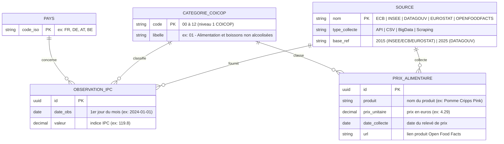

# MCD — Modèle Conceptuel de Données (C4)

**Projet :** Inflation Tracker France — B3 RNCP Développeur IA  
**Auteur :** Alberto Bongue  
**Formalisme :** Merise (entités-associations, cardinalités)  
**Date :** 2026-07

---

## Diagramme entités-associations

---

## Entités et attributs

| Entité | Identifiant | Attributs | Description |
|--------|------------|-----------|-------------|
| **SOURCE** | `nom` | type_collecte, base_ref | Source de données publiques (ECB, INSEE, DATAGOUV, EUROSTAT, OPENFOODFACTS) |
| **CATEGORIE_COICOP** | `code` (00-12) | libelle | Les 13 grandes catégories IPC niveau 1 de la nomenclature COICOP |
| **PAYS** | `code_iso` | — | Code pays ISO 3166-1 alpha-2 (FR, DE, AT…) |
| **OBSERVATION_IPC** | `id` (UUID) | date_obs, valeur | Un point de mesure de l'indice IPC à une date, pour un pays, une catégorie et une source |
| **PRIX_ALIMENTAIRE** | `id` (UUID) | produit, prix_unitaire, date_collecte, url | Prix relevé en rayon via Open Food Facts (hors table unifiée — sémantique différente des indices) |

---

## Associations et cardinalités Merise

| Association | Cardinalités | Lecture |
|-------------|-------------|---------|
| SOURCE — **FOURNIT** — OBSERVATION_IPC | (1,1) — (0,N) | Une observation provient d'**exactement 1 source**. Une source fournit **0 à N observations**. |
| CATEGORIE_COICOP — **CLASSIFIE** — OBSERVATION_IPC | (1,1) — (0,N) | Une observation appartient à **exactement 1 catégorie COICOP**. Une catégorie regroupe **0 à N observations**. |
| PAYS — **CONCERNE** — OBSERVATION_IPC | (1,1) — (0,N) | Une observation concerne **exactement 1 pays**. Un pays est associé à **0 à N observations**. |
| SOURCE — **COLLECTE** — PRIX_ALIMENTAIRE | (1,1) — (0,N) | Un prix alimentaire est collecté par **1 source** (OPENFOODFACTS). Une source collecte **0 à N prix**. |
| CATEGORIE_COICOP — **CLASSE** — PRIX_ALIMENTAIRE | (1,1) — (0,N) | Un prix alimentaire appartient à **1 catégorie**. Une catégorie regroupe **0 à N prix**. |

---

## Contrainte d'intégrité fonctionnelle (CIF)

**Sur OBSERVATION_IPC :**  
La combinaison `(date_obs, pays, categorie, source)` est unique — il ne peut exister qu'une seule observation par date, pays, catégorie et source.

> Implémentée dans le MPD par : `UNIQUE (date_obs, pays, categorie, source)` sur `inflation_unified`.

---

## Correspondance MCD → MPD (`schema.sql`)

Le MPD physique matérialise le MCD conceptuel avec des choix d'implémentation :

| Entité MCD | Table(s) MPD | Remarque |
|-----------|-------------|----------|
| OBSERVATION_IPC | `inflation_unified` | Table centrale unifiée |
| SOURCE | colonne `source` + `base_ref` dans `inflation_unified` | Dénormalisé (pas de table SOURCE séparée — choix performance) |
| CATEGORIE_COICOP | CTE `coicop_ref` dans `aggregate_clean.py` | Référentiel embarqué dans le SQL d'agrégation |
| PAYS | colonne `pays` dans `inflation_unified` | Dénormalisé |
| PRIX_ALIMENTAIRE | `openfoodfacts` | Table séparée — sémantique prix bruts ≠ indices IPC |

**Tables de staging ETL (absentes du MCD) :**  
Les 4 tables `ecb_hicp_raw`, `insee_ipc`, `datagouv_ipc`, `eurostat_bulk` sont des artefacts techniques du pipeline ETL (zones d'atterrissage temporaires). Elles ne représentent pas des entités du domaine métier — elles alimentent `inflation_unified` via `aggregate_clean.py` et disparaissent conceptuellement après agrégation.

---

## Choix de base de données

**PostgreSQL 16** retenu pour :
- ACID garanti sur 3,68M lignes (transactions ETL idempotentes via `ON CONFLICT DO NOTHING`)
- Type `NUMERIC(10,4)` sans erreur d'arrondi flottant sur les indices IPC
- `UUID` avec `gen_random_uuid()` natif (pas de séquence à gérer)
- Support des index partiels et des contraintes `UNIQUE` composites

**Issue GitHub :** #9 (C4 — base de données)  
**Script d'import :** `src/database/import_data.py`  
**Schéma physique :** `src/database/schema.sql`
